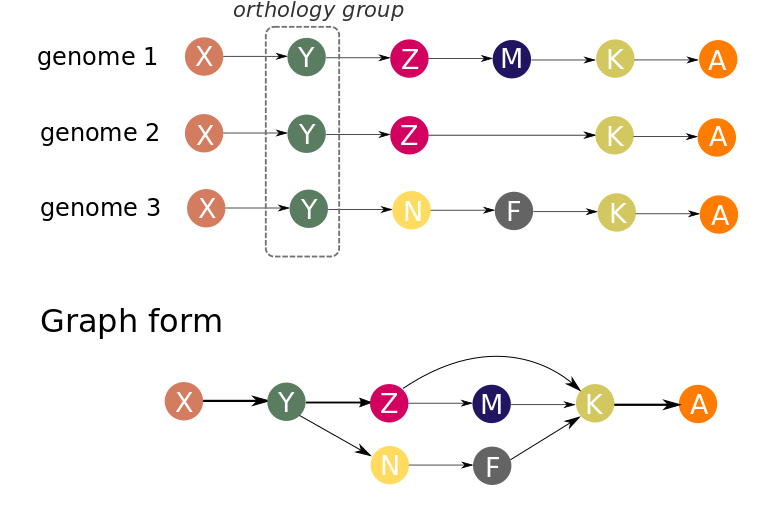
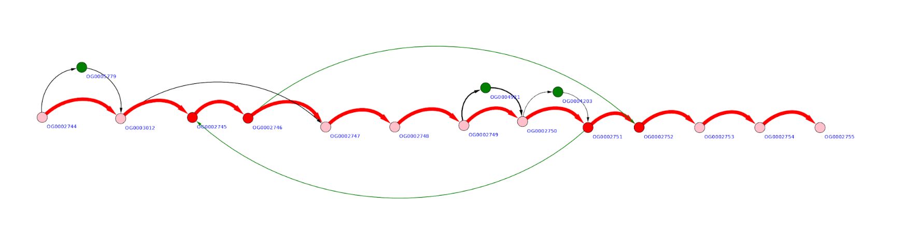
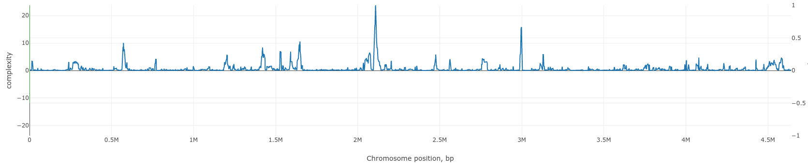
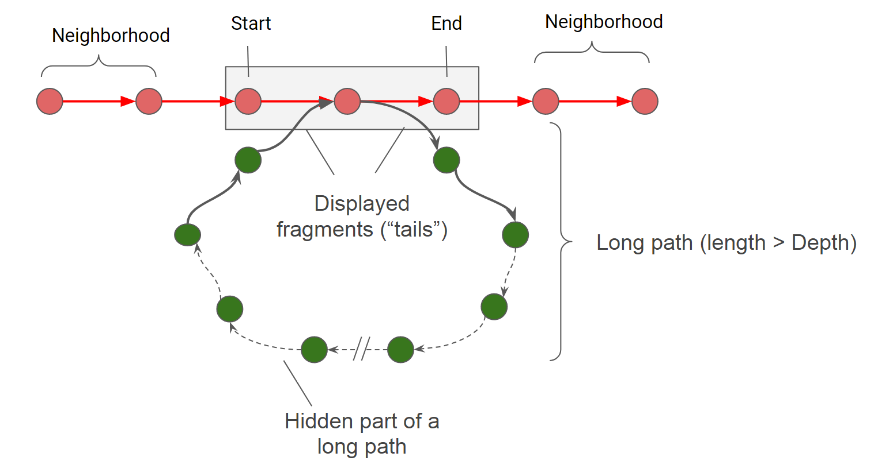

=======================
Main concepts
=======================

Graph representation of genomes
-------------------------------------------------------

Let’s consider three genomes in which orthogroups were inferred. To make a graph representation of the gene neigbourhoods in these genomes we will consider each orthogroup as a node. Nodes are connected by an edge if there is at least one genome in which corresponding genes (orthology groups representatives) are adjacent.

In our approach, genes are ordered by their centered position: (start + end)/2 on a replicon (contig). Each replicon (contig) is treated separately. Strand information is ignored in graph building procedure. Because gene order in a set of genomes is represented by a directed graph, genomes may be co-aligned against each other before graph construction to optimize their orientation, but this does not significantly affect the result.

Several genes from one genome may be present in same orthogroup (paralogous genes). This makes inapplicable the above described scheme, and we propose two possible way-outs. The first approach is to skip such orthogroups in the graph for genomes containing paralogs (however, the same orthogroup will be included in the graph for genomes containing no paralogs). Or paralogous genes can be orthologized and be incorporated in the graph. By orthologization we mean procedure, which delineate paralogues genes by adding unique suffix to each unique paralogous gene context. For example, sequence of genes: A -> B -> C -> D -> B -> E, after orthologization becomes A -> B_1 -> C -> D -> B_2 -> E.

The graph representation allows compactly represent possible variants of the repertoire and the neigbourhood of genes in genomes. However, complete graph of all genomes will be too complicated for visualization, unless you are working with viruses. To explore a certain region of interest (gene, operon, genomic island), subgraphs can be generated. Subgraph is part of a total graph that represents some specific region of the reference genome. 

Complexity profile
-------------------------

By complexity of a genomic region, we mean the number of paths in the graph representing this region. The rationale here is the following. If no genome rearrangements resulting in gene order changes are observed in this region than its graph representation will be a simple chain. If some changes are observed (insertion, deletion, transposition, inversion of regions longer than a single gene) then the graph will contain additional edges. The more frequently gene rearrangements occur in a particular genomic region the more edges (and paths) the corresponding graph will contain.

Example of a rather “quiet” region is below. Here three possible gene insertions, one deletion, and one gene transposition can be seen.

More “complex” region may look like the graph below, with multiple overlapping gene replacements and insertions.

.. image:: img/general/complex_region.png
        :alt: complex region
        :align:   center

To quantify this visual expression we implement an algorithm which counts the number of distinct paths in a (sub)graph representing some genome region - the value we will further call **complexity**.  Complexity value is calculated for a given gene in a reference genome in a window of defined width (5, 10,20 are typical values). Scanning the genome with the sliding window we obtain complexity profile of that genome. Example of such a profile for *Escherichia coli K12 MG1655* genome is given below.

Regions of low and high complexity can be seen which corresponds to cold and hot spots of genome rearrangements, mainly due to the frequency of fixed horizontal gene transfer (HGT) events.

Subgraph generation
--------------------

When generating a subgraph, the nodes of the reference genome which are located between the ``sart`` and ``end`` coordinates (set in b.p.). It is sometimes useful to expand the region of the genome under consideration, in this case, you can increase the value of the parameter ``Neighborhood`` (set in genes).

Even for small fragments of the genome (especially when they are highly variable), subgraphs may be too large for visualization and efficient analysis. We have implemented two filters to simplify subgraphs: a long path filter and a low weight edge filter. 

If the path begins and returns in the considered region of the genome, but its length is greater than the ``Depth`` parameter, then it is cropped up to fragments of length ``tails``. The same happens with all paths, which have only a beginning or only an end in the considered area. After applying the filter of long paths, a filter of low weight edges is applied, that is, such combinations of genes that occur in a small number of genomes. Edges weighing less than ``Minimal edge weight`` are excluded from the subgraph.

Genome Complexity browsing
---------------------------

We created GCB to analyze genome variability on two scales simultanously. Globally, the complexity profile of the whole genome is shown. Localy, some genome region is represented in a graph-based format. This combination creates a unique opportunity to "browse" genome variability: to find hotspots, to analyze gene contents and patterns in this hotspots, or to investigate the level of variability in the region in which the genes of interest are located.

Web browser alows surfing the Internet, our browser allows surfing genomes.

