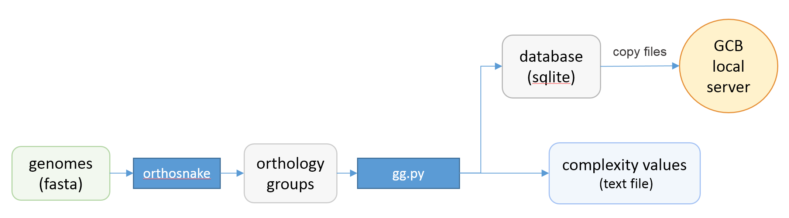

==============================================
Standalone version 
==============================================

Command-line tool
##################

Roadmap
-------

Standalone version should be used when the user wants to work with a custom set of genomes. 
Command-line scripts are provided to: calculate complexity profile, generate subgraphs, generate a database which can be imported to browser-based GUI application. Scheme of actions and scripts is shown below.

Prerequisites
-------------

**Conda**

Please refer to the `installation guide <https://docs.conda.io/projects/conda/en/latest/user-guide/install/>`_.

**Snakemake**

Installation instrctions are `here <https://snakemake.readthedocs.io/en/stable/getting_started/installation.html>`_.

**Python 3.4 or later**

**Graphviz and pygraphviz libraries**

Can be installed by running::

    sudo apt-get install graphviz python3-graphviz python3-pygraphviz

or via conda::
	
	conda install -c anaconda graphviz
	conda install -c anaconda pygraphviz

**gene_graph_lib Python3 module**

Can be installed by running::

    pip3 install gene_graph_lib

Orthogroup inference
---------------------

Orthogroup inference is the first step in the standalone analysis.
We recomend using our `orthosnake <https://github.com/paraslonic/orthosnake>`_ pipeline for inference of orthogroups, because GCB requires some special formating of the files.

**Orthosnake pipeline**

*INPUT: Fasta-formated files with .fna extension, one file per genome*

*OUTPUT: orthogroups file `Orthogroups.txt` in OrthoFinder format*

Steps: 

	1. Clone or download orthosnake GIT repository: https://github.com/paraslonic/orthosnake
	2. Put fasta-formated genome files in ``fna`` folder of the orthosnake folder. 
	3. Rut snakemake with ``--use-conda`` and other appropriate options

The following code will run analysis of the test dataset (three plasmids)::

   git clone https://github.com/paraslonic/orthosnake.git
   cd orthosnake
   cp test_fna/* fna # copy test fasta files with three plasmids
   snakemake -j 4 --use-conda

Here, we used snakemake with parameters specifying the number of available cores (``-j 4``), and using conda environments (``--use-conda``). During the first start of the pipeline, it will take about ten minutes to install the necessary programs into the conda environments.

If genome files have extension, other than ``.fna`` (e.g., ``*.fasta``) , please rename them. For example, to change the file extension from ``.fasta`` to ``.fna``, run::

	for i in fna/*.fasta; do mv $i fna/$(basename $i .fasta).fna; done

Orthosnake pipeline performs the following steps:

	* Fasta headers are modified, to satisfy the requirement of the Prokka:  
		* symbols other than alphanumericals and `_` are converted to `_`
		* if header is longer than 20 symbols, it is cropped to the first 18 symbols, and dots are added to the end (e.g., ``gi|15829254|ref|NC_002695.1`` becomes ``gi|15829254|ref|NC..``)
	* Annotation with Prokka.
	* Genebank files converted to amino acid fasta files.
	* Orthogroups are inferred with OrthoFinder.

When amino acid fasta files are generated from genebank files, information regarding location and product is included in headers in the following format: genome_name|numerical_id|start|end|product. Please note this if you want to perform orthogroups inference without using orthosnake.

Building a graph and complexity estimation with a single command
-----------------------------------------------------------------
*INPUT: orthogroups file `Orthogroups.txt` in OrthoFinder format*

*OUTPUT: graph-based representation of genomes (sqlite database), complexity values (text file)*

To perform the basic analysis, run::

	python3 gg.py -i [orthogroups file] -o [output] --reference [name of the reference genome]

Parameters:

	``-i`` -- path to orthogroups file in OrthoFinder format.

	``-o`` --	path and name prefix for output files

	``--reference`` --	name of the reference genome (its filename without extension), used for complexity estimation. This parameter can be skipped, in this case, the complexity values for all genomes in the set will be estimated (this can take a lot of time). 
	
Optional parameters:

	``--window``  -- size of the window used in the complexity estimation (default is 20). Only the paths inside the window increase the value of complexity.

  	``--genomes_list`` -- a text file containing the names of the genomes that will be used to calculate the complexity. Useful for analysis of parts of genomes, such as phylogenetic tree clades, for their subsequent comparison.

	``--coalign`` -- a binary value (True/False) that determines whether to perform the step of selecting the optimal genomes orientation. It can take a lot of time when using a large number of draft genomes (5 hours for 1000 draft genomes).

Advanced complexity estimation algorithm settings (practically not used):

	``--iterations`` --  number of iterations in algorithm (default is 500)
                        
	``--min_depth`` -- minimum length of deviating path (default is 0)

	``--max_depth`` -- maximum length of deviating path (default is inf)
 
Main output files are:

	- :file:`<output>.db` - SQLite database conatining graph and complexity values,  paralogues genes are skipped.
	- :file:`<output>_pars.db` - SQLite database conatining graph and complexity values, paralogues genes are orthologized.
	- :file:`[reference genome]/prob_window_complexity_contig_[contig].txt` - text file containing complexity values for each contig in the reference genome. 
	- :file:`<output>_context.sif` - number of unique contexts, computed for each node in graph
	- :file:`<output>_genes.sif` - list of all genes (nodes) from all genomes, with coordinates and Prokka annotations

Where, ``<output>`` is what was specifiend in ``-o`` option, while running `gg.py`.

Local GCB server 
##################