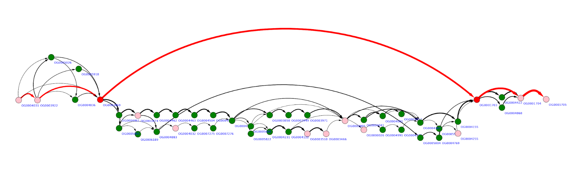
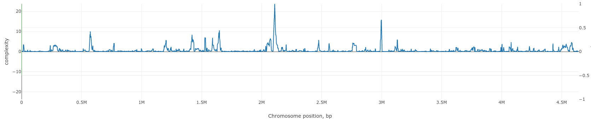

=======================
Main concepts
=======================

Graph representation of genomes
-------------------------------------------------------

Let’s consider three genomes in which orthology groups were inferred. To make a graph representation of the genome order in these genomes we will consider each orthology group as a node. Nodes are connected by an edge if there is at least one genome in which corresponding genes (orthology groups representatives) are adjacent.

.. image:: img/general/graph_scheme.png
        :alt: graph scheme
        :align:   center

Genes are considered to be located on the same strand and are ordered by their centered position: (start + end)/2 on a replicon (contig). Each replicon (contig) is treated separately. Because gene order in a set of genomes is represented by a directed graph, genomes are aligned against each other before graph construction to optimize their orientation.

Paralogous genes can be orthologized and be incorporated in graph. By orthologization we mean procedure, which delineate paralogues genes by adding unique suffix to each unique paralogous gene context. For example, sequence of genes: A -> B -> C -> D -> B -> E, after orthologization becomes A -> B_1 -> C -> D -> B_2 -> E.

Complexity profile
-------------------------

By complexity of a genomic region, we mean the number of paths in the graph representing this region. The rationale here is the following. If no genome rearrangements resulting in gene order changes are observed in this region than its graph representation will be a simple chain. If some changes are observed (insertion, deletion, transposition, inversion of regions longer than a single gene) then the graph will contain additional edges. The more frequently gene rearrangements occur in a particular genomic region the more edges (and paths) the corresponding graph will contain.

Example of a rather “quiet” region is below. Here three possible gene insertions, one deletion, and one gene transposition can be seen.

.. image:: img/general/quiet.png
        :alt: quiet region
        :align:   center

More “complex” region may look like the graph below, with multiple overlapping gene replacements and insertions.

To quantify this visual expression we implement an algorithm which counts the number of distinct paths in a (sub)graph representing some genome region - the value we will further call **complexity**.  Complexity value is calculated for a given gene in a reference genome in a window of defined width (5, 10,20 are typical values). Scanning the genome with the sliding window we obtain complexity profile of that genome. Example of such a profile for *Escherichia coli K12 MG1655* genome is given below.

Regions of low and high complexity can be seen which corresponds to cold and hot spots of genome rearrangements, mainly due to the frequency of fixed horizontal gene transfer (HGT) events.
