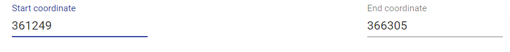

===================================
GUI description
===================================

GUI elements
##############

GCB page consists of three main parts: 1) top panel to select genome and region to work with, 2) complexity plot which shows complexity profile for selected genome and contig, 3) subgraph visualization form.

The **top panel** allows selecting one of the precalculated organisms, reference genome and contig (replicon for finished assemblies). The right side of the panel allows selecting the region of the genome for the subgraph visualization. User can specify the start and end coordinates of the region. OG identifiers (which can be taken from the subgraph visualization) can also be used to define a range. Draw paralogues option changes the default program behavior which is to ignore genes which have paralogues. When this option is switched ON,  orhologization of paralogous genes is applied to draw subgraph and calculate complexity. By default,  paralogous genes are not displayed and not contribute to complexity value.

.. image:: img/face/face1.png
        :align:   center

**Complexity plot** panel shows a visualization of complexity profile and allows a user to visualize custom data (GC content, pathogenicity islands, prophage regions, sequence motifs, etc.). Complexity profile can be downloaded as a text file. User can add custom features file, in which each line should be in the format:  <genome position> <numeric value>

.. image:: img/face/face2.png
        :align:   center

**Subgraph visualization** form contains a number of settings to simplify and customize subgraph. On the bottom, there is information about edges (which genomes contain the corresponding edge) and nodes (gene product).

.. image:: img/face/face3.png
        :align:   center

To explain parameters of visualization let's consider subgraph construction procedure: 1) nodes of the reference genome in selected region (+/- *window* ) are added, this is called base chain; 2) all paths which connect with the base chain are added to subgraph; 3) paths which start and end on the base chain and which have length <= *Depth* remain unchanged; 4) all other paths are cropped to the *Tails* length; 5) edges with number of genomes (weight) lower than *minimal edge* weight are removed from the subgraph.

By clicking on the edge user selects this edge. List of genomes which contain gene pair corresponding to the selected edge is shown on the information panel. Edges which have at least one of the genomes from this list are colored blue.

User can upload colors for the nodes from the current subgraph. Each line of this file should be in the format:<OG id> <hex color code>::

	OG000004 #ff0000
	OG000005 #777777

Step-by-step tutorials
#######################

Complexity analysis
--------------------

Gene neigbourhood analysis
---------------------------

Consider we are interested in a particular operon and we want to know more about its representation in a particular group of organisms. Let's take `lactose operon <https://en.wikipedia.org/wiki/Lac_operon>`_ with its regulator in the Escherichia coli as an example (we will call it lac operon further).

First, we need to determine genome position of genes of interest. We can do it in multiple ways, e.g., from `EcoCyc <https://www.google.com/url?q=https://biocyc.org/ECOLI/NEW-IMAGE?type%3DOPERON%26object%3DTU00036&sa=D&ust=1585816672295000>`_ database or from `NCBI Refseq <https://www.ncbi.nlm.nih.gov/nuccore/NC_000913.3>`_. In our case, according to BioCyc, genome region of interst is located at 361249-366305 in *K-12 substr. MG1655*. First we select Escherichia coli as ``Organism`` in a dataset containing 300 *E. coli* genomes. Then we select K-12 MG1655 as ``Reference``. Only one contig is present (finished genome, no plasmids), so we do not need to change ``Contig`` value.

.. image:: img/tutorial/use1/use1_1.png
        :scale: 80 %

Then we should put the operon's margin coordinates to text fields: ``Start coordinate`` and ``End coordinate``.



Now we click ``Draw`` button on the bottom panel and graph representation of the operon appears. 

.. image:: img/tutorial/use1/use1_3.png

We can see that edges are of different colors: black and red. Red colored are edges which are in agreement with the reference genome, i.e. they represent the gene order of reference genome. All other edges are black, they correspond to genes neighbourhood variants not present in a reference genome. Nodes of genes which present in a reference genome are colored pink, nodes for genes absent in a reference genome are colored green. Gray rectangle is drawn around nodes located between ``Start coordinate`` and ``End coordinate`` (lac operon genes in our case), other nodes are added to show the context. 

More clear layout can be obtained manually by left clicking and dragging nodes with mouse.

.. image:: img/tutorial/use1/use4_.png

We can see now that operon is located in a conservative context in most of the genomes (thick edges designated with 1 and 2).
We may notice that one of the operon’s genes is absent in some set of genomes. By left clicking on that gene we can examine its gene product. Gene products are assigned with `prokka <https://github.com/tseemann/prokka>`__ tool in the web version of GCB. Text in popup box is formated as ```product: length (position)``` (length in nucleotides, position is reported only for genes present in refernce genome).

.. image:: img/tutorial/use1/select_node.gif

In our case it is Galactoside acetyltransferase which is missing from the operon in some set of genomes. What are that genomes? By clicking on the bypassing edge we can select it. Selection of the edge results in two effects: 1) names of genomes corresponding to this edge (those genomes in which linked by the edge genes are located next to each other) appears in a ``List of genomes`` section below the graph, 2) other edges containing at least one of the genomes corresponding to the selected edge are colored blue. In this way, we can determine what possible variants of gene content and gene order are present, and in which genomes. 

.. image:: img/tutorial/use1/select_edge.gif

For now we have determined that a number of genomes does not contain Galactoside acetyltransferase (we can copy-paste their names and calculate the total number, 29 in this case). We can also notice nodes connected by a thin edges which seems to represent other alternative variants of the operon. Let's click on them and on nodes from reference to see their products.  

.. image:: img/tutorial/use1/look_orphans1.gif

In this case we see that their names are the same, but their length differ a lot: 263 b.p. for an outlier gene and 1253 b.p. for a reference gene. Often, and also in this particular case,  it comes from frameshit splitting some genes into parts, some of which may become part of homology groups representing original gene. 

.. image:: img/tutorial/use1/look_orphans1.gif


Finaly to verify our findings let's switch to paralogues orthologization mode. To do it you should toggle ``Draw paralogous`` switcher on the top panel and click ``Draw`` button once more (be careful, your current graph layout will be lost, so consider opening new page). After clicking and dragging nodes it should be looking like this. A little bit scary.

.. image:: img/tutorial/use1/paralogs.png

This more complicated graph comes from not ignoring paralogous genes as it done by default, but instead showing all of them.


Our analysis was not quick and simple, its more like exploration than gaining quick answers. And like web browser gives opportunity to surfe the internet, our browser allows surfing genomes.


Combined analysis
------------------
