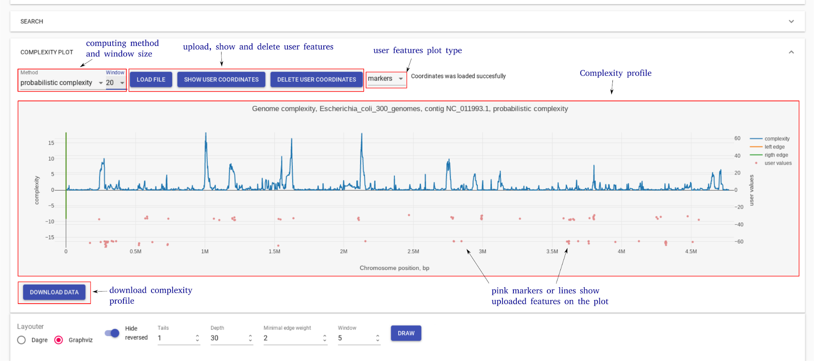

===================================
Interface elements and settings
===================================

GCB page consists of three main parts: 1) top panel to select genome and region to work with, 2) complexity plot which shows complexity profile for selected genome and contig, 3) subgraph visualization form.

The **top panel** allows selecting one of the precalculated organisms, reference genome and contig (replicon for finished assemblies). The right side of the panel allows selecting the region of the genome for the subgraph visualization. User can specify the start and end coordinates of the region. OG identifiers (which can be taken from the subgraph visualization) can also be used to define a range. Draw paralogues option changes the default program behavior which is to ignore genes which have paralogues. When this option is switched ON,  orhologization of paralogous genes is applied to draw subgraph and calculate complexity. By default,  paralogous genes are not displayed and not contribute to complexity value.

.. image:: img/face/face1.png
        :align:   center

**Complexity plot** panel shows a visualization of complexity profile and allows a user to visualize custom data (GC content, pathogenicity islands, prophage regions, sequence motifs, etc.). Complexity profile can be downloaded as a text file. User can add custom features file, in which each line should be in the format:  <genome position> <numeric value>

**Subgraph visualization** form contains a number of settings to simplify and customize subgraph. On the bottom, there is information about edges (which genomes contain the corresponding edge) and nodes (gene product).

.. image:: img/face/face3.png
        :align:   center

To explain parameters of visualization let's consider subgraph construction procedure: 1) nodes of the reference genome in selected region (+/- *window* ) are added, this is called base chain; 2) all paths which connect with the base chain are added to subgraph; 3) paths which start and end on the base chain and which have length <= *Depth* remain unchanged; 4) all other paths are cropped to the *Tails* length; 5) edges with number of genomes (weight) lower than *minimal edge* weight are removed from the subgraph.

By clicking on the edge user selects this edge. List of genomes which contain gene pair corresponding to the selected edge is shown on the information panel. Edges which have at least one of the genomes from this list are colored blue.

User can upload colors for the nodes from the current subgraph. Each line of this file should be in the format:<OG id> <hex color code>::

	OG000004 #ff0000
	OG000005 #777777
