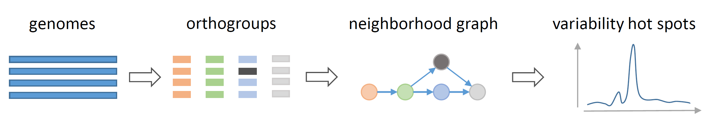

===================================
Genome Complexity Browser
===================================
 
GCB is created to analyse variability of prokaryote or viral genomes.

Graph-based representation of gene neigbourhood is used to:

- make compact visualization of genome changes
- evaluate local geneome variability

Local genome variability is estimated as the number of paths in the graph-based represention of the genome region. We call it complexity.
Complexity profiles reveal hot-spots of genome variability, for most of genomes due to horizontal gene transfer events, and cold regions with little changes in gene order.

Graph-based visualization may help answer questions regarding gene context and diversity of genes in particular loci. 

This server contains precaluclated data for 143 prokaryote species. Complete list of species and strains can be found here.
Tutorials and documentation can be found on RTFM.

==> Browse precalulated set <==

Standalone version is available to analize custom genome set, it consists of command-line tools and stand-alone browser based application.
Tutorials and documentation will be needed to operate GCB and can be found on RTFM.

Google group is available to ask questions.

Here you can find graph-based representation of some operons and genome islands with comments.

GCB is opensource and can freely used without any warranty on the basis of BSD licence.

Preprint is available. Please cite it when reporting results obtained with GCB.

