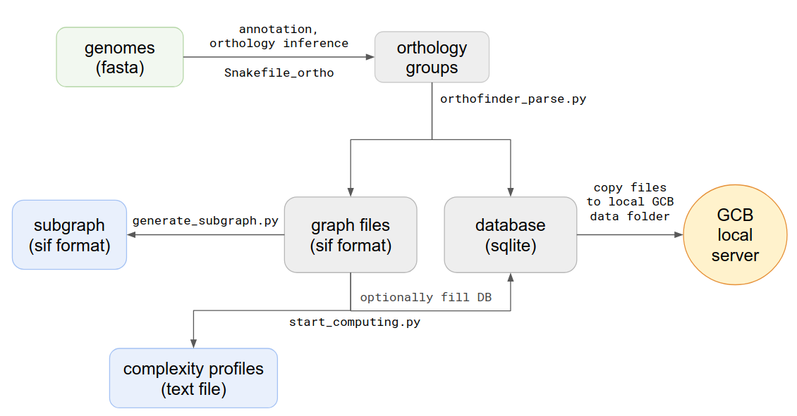

==============================================
Standalone version 
==============================================

Roadmap
########

Standalone version should be used when the user wants to work with a custom set of genomes. 
Command-line scripts are provided to: calculate complexity profile, generate subgraphs, generate a database which can be imported to browser-based GUI application. Scheme of actions and scripts is shown below.

Command-line tools
###################

Prerequisites
-------------

Orthogroup inference
---------------------

Orthogroup inference is the first step in the standalone analysis.
We recomend using our `orthosnake <https://github.com/paraslonic/orthosnake>`_ pipeline to perfrom orthogroup inference, because GCB requires some special formating of the files.

**Orthosnake pipeline**

*INPUT: Fasta-formated files with .fna extension, one file per genome*

*OUTPUT: orthogroups file `Orthogroups.txt` in OrthoFinder format*

Steps: 

	1. Clone or download orthosnake GIT repository: https://github.com/paraslonic/orthosnake
	2. Put fasta-formated genome files in fna folder of the orthosnake folder. 
	3. Rut snakemake with appropriate settings

Example:

.. code-block:: bash
   git clone git@github.com:paraslonic/orthosnake.git
   cd orthosnake
   cp test_fna/* fna # copy test fasta files with three plasmids
   snakemake -j 5 -k --latency-wait 120 --use-conda

If genome files have extension other than .fna please rename them, i.e. with following command:
`for i in fna/*.fasta; do mv $i fna/$(basename $i .fasta).fna; done`

### Algorightm

* Fasta files headers are modified to be consistent with Prokka:  
  * if header contains symbols other than alphanumericals and `_` they are converted to `_`
  * if header is longer than 20 symbols it is cropped to first 18 symbols and dots are added to the end (i.e. `gi|15829254|ref|NC_002695.1` becomes `gi|15829254|ref|NC..`)
* Annotation with Prokka 
* Amino acid fasta files are generated from genebank files; gene location and product information are listed in headers.
* Orthogroups are inferred with OrthoFinder.

Building a graph
-----------------

Graph structure is stored in text file with sif format, and in database
When orthogroups are inferred, the next step is parsing of Orthofinder outputs. To do this you should open source directory and type in terminal::

	python3 parse_og.py  -i [path to txt file with orthogroups] -o [path and name prefix for output files]

For example::

	python3 parse_og.py  -i ~/data/Mycoplasma/Results/Orthogroups.txt -o ~/data/outputs/Mycoplasma/graph

Main output files:

	- :file:`graph.sif` - all edges list of the genomes graph
	- :file:`graph.db` - SQLite database with all parsed information
	- :file:`graph_context.sif` - number of unique contexts, computed for each node in the graph
	- :file:`graph_genes.sif` - list of all genes (nodes) from all genomes, with coordinates and Prokka annotations

The main graph structure is stored in a text graph.sif file, where each one line describes one edge, with its source and target nodes, genome id and contig id, to which this edge belongs. This file is used to create a graph object, which is used in all graph processing procedures.

Complexity estimation
-------------------------

The next step is the computing of genome complexity. To do this type in terminal:: 

	python3 start_computing.py -i graph.sif -o [path to output folder] --reference [name of reference genome]

Additional parameters:
	--window - sliding window size (default 20)
	
	--iterations - number of iterations in probabilistic method (default 500)

	--genomes_list - path to file with a list of names which will be used to create a graph (default all strains from *.sif will be used)

	--min_depth, --max_depth - minimum and maximum depth of generated paths in the graph (default from 0 to inf)

	--save_db - path to the database, created by orthfinder_parse.py (default data will not be saved to db, only to txt). It’s necessary to use this parameter if you want to use this complexity profile in the stand-alone browser-based GCB application.

Output files for each contig in the reference genome:

	:file:`all_bridges_contig_n.txt` - this file contains information about the number of deviating paths between each pair of nodes in the reference genome

Subgraph visualization
-----------------------

PODVAL
-------------------

Then gene annotation with prokka  tool of each genome is performed. Genbank files then converted to fasta formatted amino acid protein sequences with a custom python3 script. This script inserts special information about genes in fasta headers, namely: genome file name, numeric id, product name, contig, start, end (for example, ``>GCF_000007445|4|Threonine_synthase|NC_004431.1|4445|5731``). Then these files are used to infer orthology groups with OrthoFinder tool. The resulting file with orthology groups (OG) contains information about each OG in the following format: ``<og id>: <gene1> <gene2> …``

For example::

	OG0008594: GCF_001618325|2406|Small_toxic_polypeptide_LdrD|NZ_CP015069.1|2607133|2607240 GCF_001663475|366|Small_toxic_polypeptide_LdrD|NZ_CP015159.1|380042|380149

