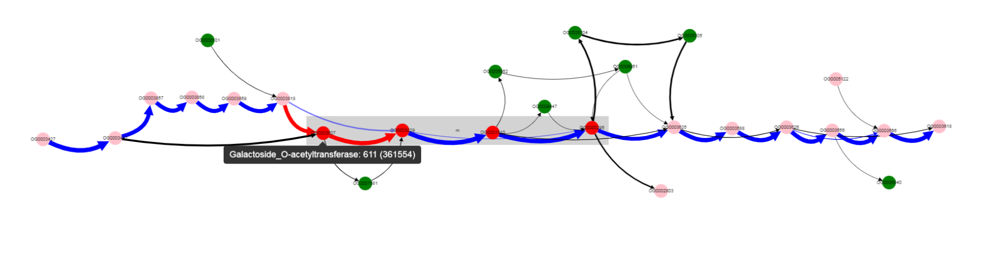

=============================
Use cases
=============================

Determine gene context of operon of interest
----------------------------------------------

Consider we are interested in a particular operon and want to know something about its representation in a particular group of organisms. Let's take lactose operon of Escherichia coli as example.

First we need to determine its genome position, i.e. in `EcoCyc <https://www.google.com/url?q=https://biocyc.org/ECOLI/NEW-IMAGE?type%3DOPERON%26object%3DTU00036&sa=D&ust=1585816672295000>`_ database. Positions of start and end genes of the operon are 361249-366305 in  *K-12 substr. MG1655* genome. First we select Escherichia coli as ``Organism`` (dataset containing 300 genomes) and K-12 as ``Reference``. Only one contig is present (finished genome, no plasmids), so we do not need to change ``Contig`` value.

.. image:: img/tutorial/use1/use1_1.png

Then we should put operon margins to text fields: ``Start coordinate`` and ``End coordinate``.

.. image:: img/tutorial/use1/use1_2.png

Now we click ``Draw`` button on the bottom panel and graph representation of the operon appears. 

.. image:: img/tutorial/use1/use1_3.png

More clear layout can be obtained manually by left clicking and dragging nodes with mouse.

.. image:: img/tutorial/use1/use1_4.png

Gray rectangle is drawn around nodes between  ``Start coordinate`` and ``End coordinate`` (lac operon genes in our case), other nodes are added to show context. 
We can see that this operon is located in a conservative context mainly (thick edges designated with 1 and 2). Edge designated with 3 tells us that one of the operon’s genes is absent in some set of genomes. Lets left click on the edge 3 and on the node below. We will see that some edges changed their colors and a popup text with a gene name appeared.   

