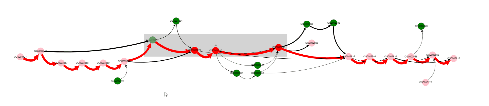
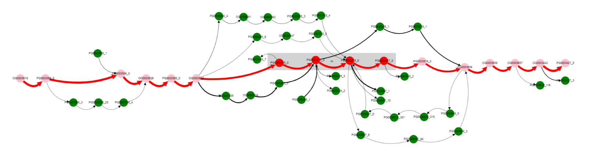

=============================
Use cases
=============================

Determine context and variants of operon of interest 
-----------------------------------------------------

Consider we are interested in a particular operon and want to know more about its representation in a particular group of organisms. Let's take `lactose operon <https://en.wikipedia.org/wiki/Lac_operon>`_ with its regulator in the Escherichia coli as example.

First we need to determine genome position of genes of interest. We can do it in multiple ways, i.e. from `EcoCyc <https://www.google.com/url?q=https://biocyc.org/ECOLI/NEW-IMAGE?type%3DOPERON%26object%3DTU00036&sa=D&ust=1585816672295000>`_ database or from `NCBI Refseq <https://www.ncbi.nlm.nih.gov/nuccore/NC_000913.3>`_. In our case, according to BioCyc, genome region of interst is located at 361249-366305 in *K-12 substr. MG1655*. First we select Escherichia coli as ``Organism`` in a dataset containing 300 *E. coli* genomes. Then we select K-12 MG1655 as ``Reference``. Only one contig is present (finished genome, no plasmids), so we do not need to change ``Contig`` value.

.. image:: img/tutorial/use1/use1_1.png
        :scale: 80 %

Then we should put the operon's margin coordinates to text fields: ``Start coordinate`` and ``End coordinate``.

.. image:: img/tutorial/use1/use1_2.png
        :scale: 80 %

Now we click ``Draw`` button on the bottom panel and graph representation of the operon appears. 

.. image:: img/tutorial/use1/use1_3.png

More clear layout can be obtained manually by left clicking and dragging nodes with mouse.

Gray rectangle is drawn around nodes between ``Start coordinate`` and ``End coordinate`` (lac operon genes in our case), other nodes are added to show the context. 
We can see that this operon is located in a conservative context in most of the genomes (thick edges designated with 1 and 2). 
One of the operon’s genes is absent in some set of genomes. By left clicking on that gene we can examine gene product. Gene products are assigned with `prokka <https://github.com/tseemann/prokka>`__ tool in the web version of GCB. 

In our case it is Galactoside acetyltransferase which is missing from the operon in some set of genomes. What are that genomes? By clicking on the bypassing edge we can select it. Selection of the edge results in two effects: 1) names of genomes corresponding to this edge (those genomes in which linked by the edge genes are located next to each other) appears in a ``List of genomes`` section below the graph, 2) other edges containing at least one of the genomes corresponding to the selected edge are colored blue. In this way, we can determine what possible variants of gene content and gene order are present and in which genomes. 

.. image:: img/tutorial/use1/select_edge.gif

For now we have determined that a number of genomes does not contain Galactoside acetyltransferase (we can copy-paste their names and calculate the total number, 29 in this case). We can also notice nodes connected by a thin edges which seems to represent other alternative variants of the operon. 

To verify our findings let's switch to paralogues orthologization mode. To do it you should toggle ``Draw paralogous`` switcher on the top panel and click ``Draw`` button once more (be careful, your current graph layout will be lost, so consider opening new page with GCB). After clicking and dragging nodes it should be something like this.

